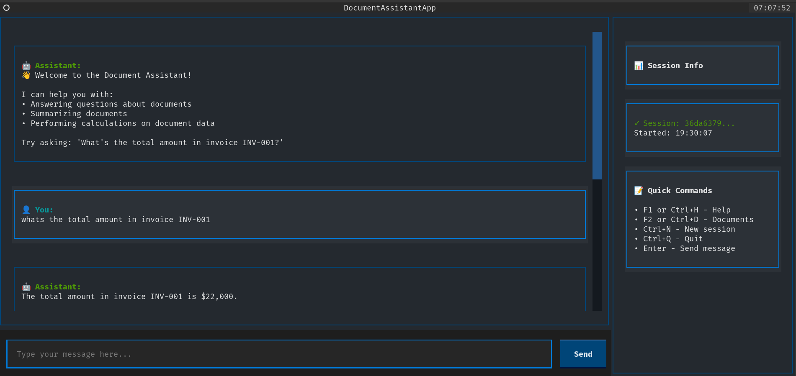
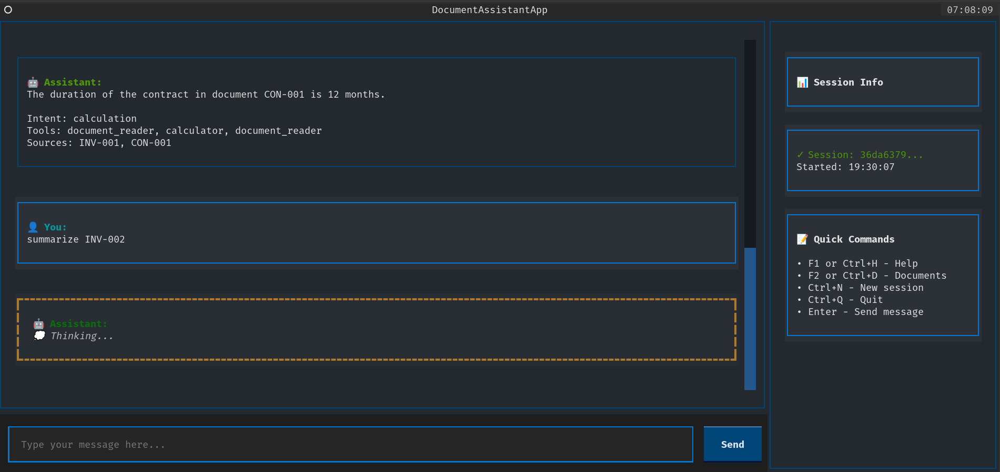
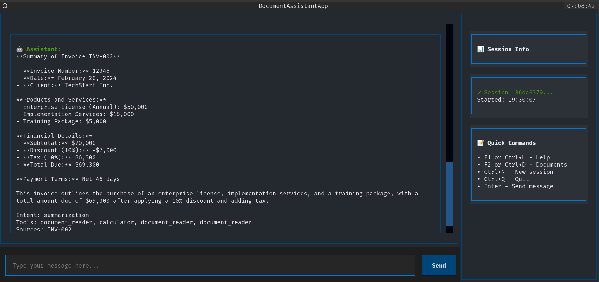

# Document Assistant - Textual UI Guide

## Overview

The Document Assistant has a **beautiful terminal interface**:

**Terminal UI (TUI)** - Rich, interactive terminal interface built with the Textual framework for a modern, beautiful experience!


## Screenshots





## Installation

### Install Dependencies

```bash
pip install -r requirements.txt
```

This will install:
- `textual` - Beautiful TUI framework
- All other dependencies

## Running the Application

### Terminal UI (Recommended)

```bash
python3 app_textual.py
```

**Features:**
- ✨ Beautiful, modern terminal interface
- 🎨 Syntax highlighting and rich formatting
- ⌨️ Keyboard shortcuts for quick actions
- 📊 Real-time session information sidebar
- 🔄 Smooth scrolling and animations

**Keyboard Shortcuts:**
- `Enter` - Send message
- `Ctrl+D` - Show available documents
- `Ctrl+H` - Show help
- `Ctrl+N` - Start new session
- `Ctrl+Q` - Quit application


### Classic CLI (Alternative)

```bash
python3 main.py
```

The original command-line interface is still available.

## Interface Overview

### Main Chat Area
- **User messages** - Displayed in cyan with 👤 icon
- **Assistant messages** - Displayed in green with 🤖 icon
- **Metadata** - Shows intent, tools used, and sources

### Sidebar
- **Session Info** - Current session ID and start time
- **Quick Commands** - Keyboard shortcut reference

### Status Bar
- Shows current operation status
- Displays errors and success messages

### Header & Footer
- **Header** - Shows app title and current time
- **Footer** - Shows available keyboard shortcuts

## Example Usage

### 1. Start the App
```bash
python3 app_textual.py
```

### 2. Ask Questions
```
What's the total amount in invoice INV-001?
```

### 3. Request Summaries
```
Summarize all contracts
```

### 4. Perform Calculations
```
Calculate the sum of all invoice totals
```

### 5. Use Keyboard Shortcuts
- Press `Ctrl+D` to see all available documents
- Press `Ctrl+H` for help and examples
- Press `Ctrl+N` to start a fresh session

## Customization

### Change Colors

Edit the `CSS` section in `app_textual.py`:

```python
CSS = """
Screen {
    background: $surface;  # Change background color
}

.user-message {
    background: $boost;    # Change user message color
    border: solid $accent;
}
"""
```

### Modify Layout

The layout is defined in the `compose()` method of `DocumentAssistantApp`.

## Troubleshooting

### Issue: "Module 'textual' not found"
**Solution:** Run `pip install -r requirements.txt`


### Issue: Terminal looks broken
**Solution:** Make sure your terminal supports colors. Try a modern terminal like:
- iTerm2 (Mac)
- Windows Terminal (Windows)
- GNOME Terminal (Linux)

## Advanced Features

### Session Management
- Sessions are automatically saved
- Each session has a unique ID
- Start new sessions with `Ctrl+N`

### Document Context
- The assistant remembers which documents you've discussed
- Context is maintained across the conversation
- View active documents in the sidebar

### Tool Usage Tracking
- See which tools the assistant used
- Tools are logged for debugging
- Check logs in `./logs/` directory

## Comparison: Terminal UI vs Classic CLI

| Feature | Terminal UI | Classic CLI |
|---------|-------------|-------------|
| Beautiful Interface | ✅ | ❌ |
| Keyboard Shortcuts | ✅ | ❌ |
| Rich Formatting | ✅ | ⚠️ Limited |
| Sidebar Info | ✅ | ❌ |
| Session Management | ✅ | ✅ |

## Tips for Best Experience

1. **Use a modern terminal** - Supports colors and Unicode
2. **Maximize your window** - More space for conversations
3. **Use keyboard shortcuts** - Faster navigation
4. **Check the sidebar** - Quick access to session info

## Development

### Running in Dev Mode

```bash
# Terminal UI with auto-reload
textual run --dev app_textual.py

# View Textual console for debugging
textual console
```

### Customizing the UI

The UI is built with Textual widgets:
- `Header` / `Footer` - Top and bottom bars
- `ScrollableContainer` - Chat message area
- `Input` - Message input field
- `Button` - Send button
- `Static` - Text displays

See the [Textual documentation](https://textual.textualize.io/) for more.

## Next Steps

1. Try the terminal UI
2. Experiment with different queries
3. Customize the colors and layout

Enjoy your beautiful Document Assistant! 🎉
